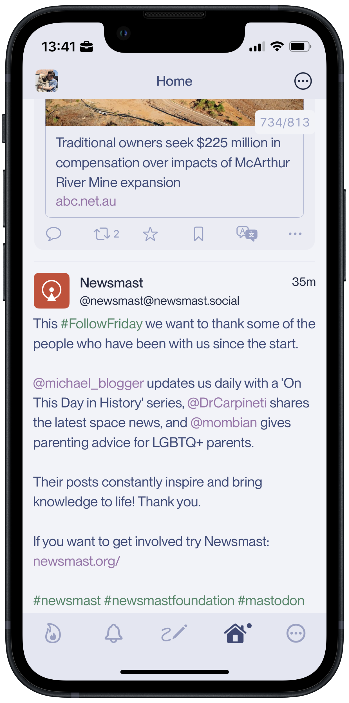
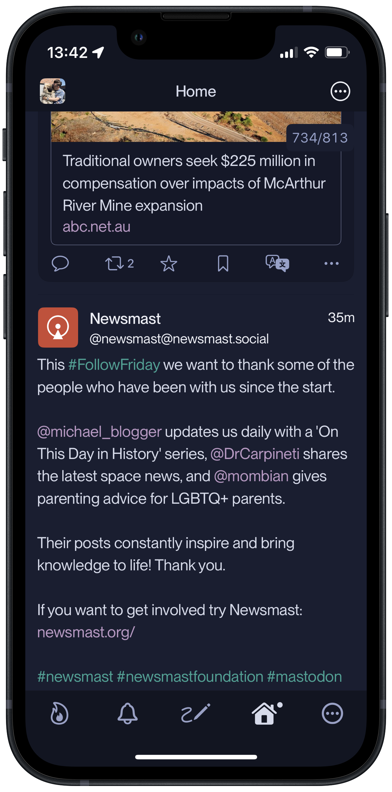
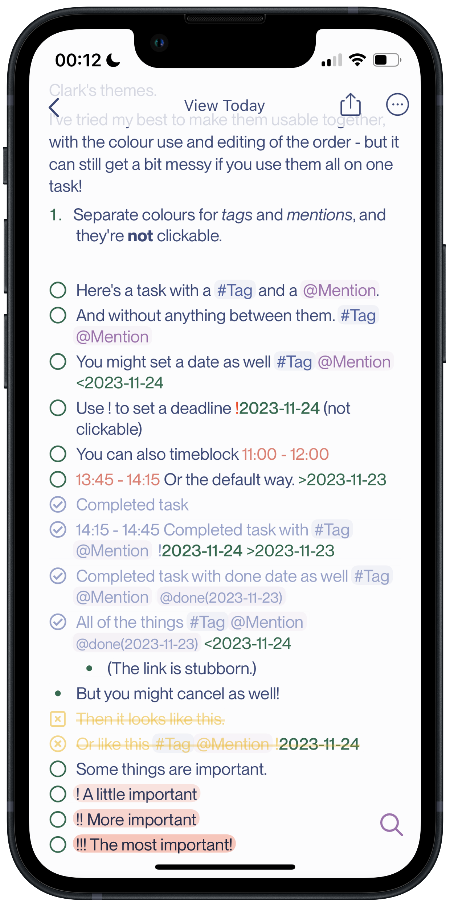
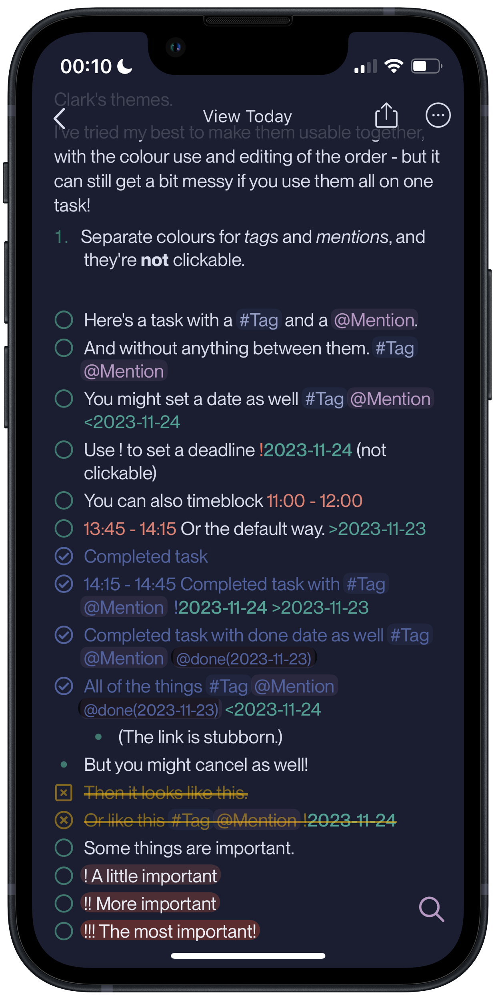

# Havn-themes

A collections of themes in the _Havn_ colourway.

## Apps currently supported:

- [Mona](https://mastodon.social/@MonaApp)
- [Noteplan](https://noteplan.co)

### Apps I'd like to make for:

- Obsidian
- Drafts
- Ulysses
- iTerm 2
- Code editors...

Feel free to contact me if you have wishes for apps or if you want to make one!

## Naming

_Havn_ means _harbour_ in Norwegian, and I've named [my blog](https://havn.blog) that, as it's supposed to be a safe haven for my (too many) thoughts, that I always carry with me.

The light version is called _Daggry_, which means _dawn_,
and the dark version is called _Skumring_, which means _dusk_.

So, that gives us:

- Light version: **Havn Daggry**
- Dark version: **Havn Skumring**

## Typefaces

I like to use [Neue Montreal](https://pangrampangram.com/products/neue-montreal) (and it's [mono sibling](https://pangrampangram.com/products/neue-montreal-mono)) and [Writer](https://pangrampangram.com/products/writer) from [Pangram Pangram](https://pangrampangram.com/). And they have a generous selection, for personal use, even without buying the entire familiy. A great app for installing apps on your iOS devices, is [Fontcase](https://apps.apple.com/app/id1205074470?ls=1&mt=8&uo=4&at=10l4G7&ct=APPS) by [The Iconfactory](https://iconfactory.com/)https://iconfactory.com/.

But the themes ofc. works with standard fonts as well! Apple is a bit stingy with it's fonts out-of-the-box for some reason, so it could actually be a good idea to install [these files](https://www.dropbox.com/sh/lcna9x23al8z6hq/AAAtvz5qHzCH3XXEt45J8Ntga?dl=0) with Fontcase to get some more options in San Francisco and New York.

## Colours

The idea behind the colours, is to have a maritime feel with a couple of accents. These are the main colours, but I adapt them to the specific need, so they might not be these exact ones.

### Main text colours

The main colours are all shades of the same blue (same _hue_ and _saturation_, with just differing _lightness_) - the backgrounds are very light (or very dark) blue, and the text is the opposite. The higher in the hierarcy a header is, the more contrast the text has.

Here's the main text colours. _Daggry_ left, _Skumring_ right (in parentheses):

- backgroundColour: **#fcfcfd** (**#1a1e30**)
- altBackgroundColour: #f2f3f8 (#121521)
- h1: #212840 (#eef0f6)
- h2: #29304e (#eaecf4)
- h3: #30395c (#e5e7f1)
- h4: #363f66 (#dde0ed)
- mainContrast: **#3e4a77** (**#d7dbea**)

### Accents

The primary accents are a green and a purple, with a variation. I also set the lightness on the main blue colour in the middle of text/bg some times. For apps that needs them, there's also an orange, red, pink and yellow accent.

- greenDarker: #386a51 (#40786f)
- greenLighter: #468666 (#54a094)
- purpleDarker: #9b73ab (#9f79af)
- purpleLighter: #a986b6 (#b699c2)
- blueDarker: #52629e
- blueLighter: #97a1c8
- orange: #fd8519
- red: #e94f2d
- pink: #da8174
- yellow: #eec659 (#d09e16)
